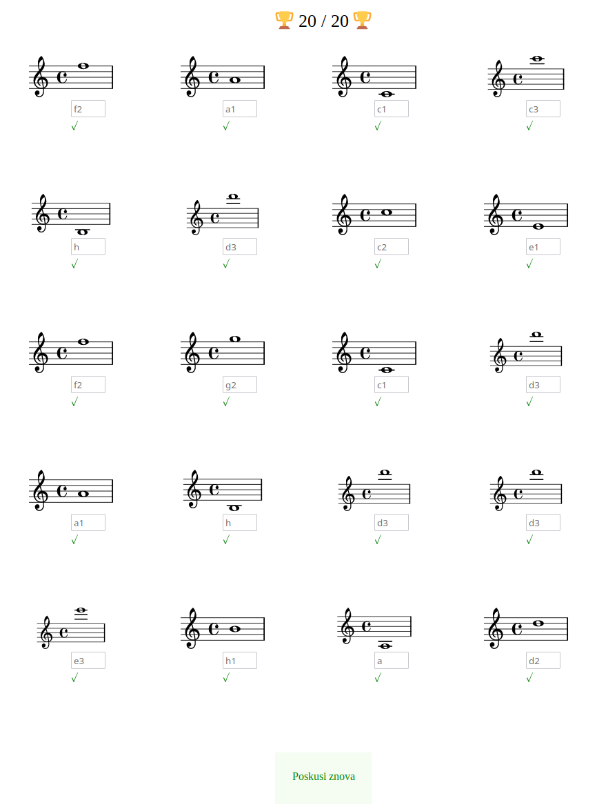
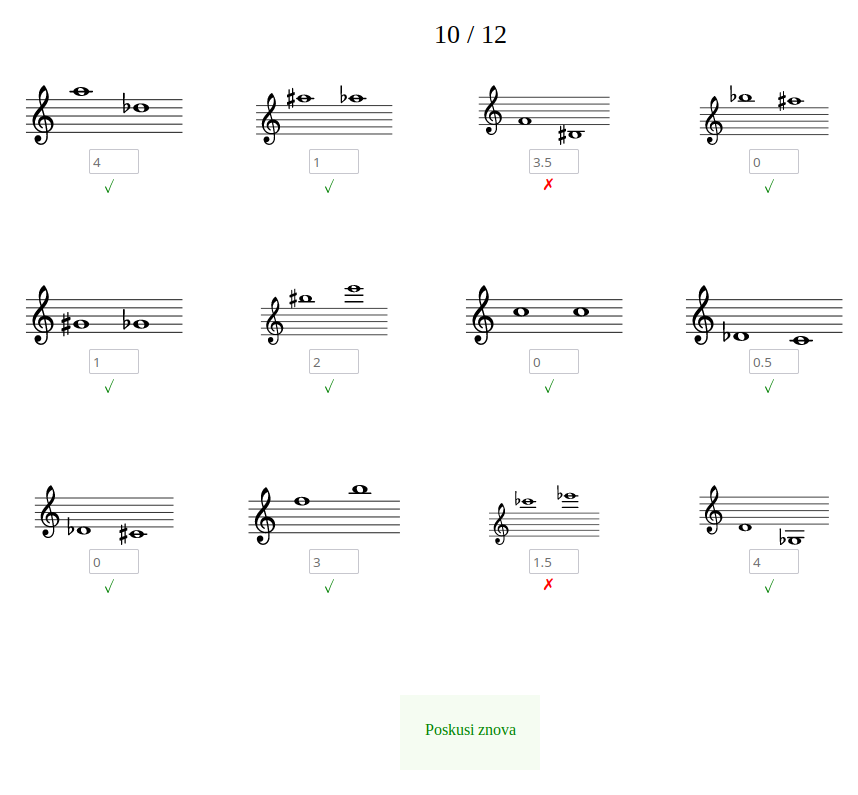
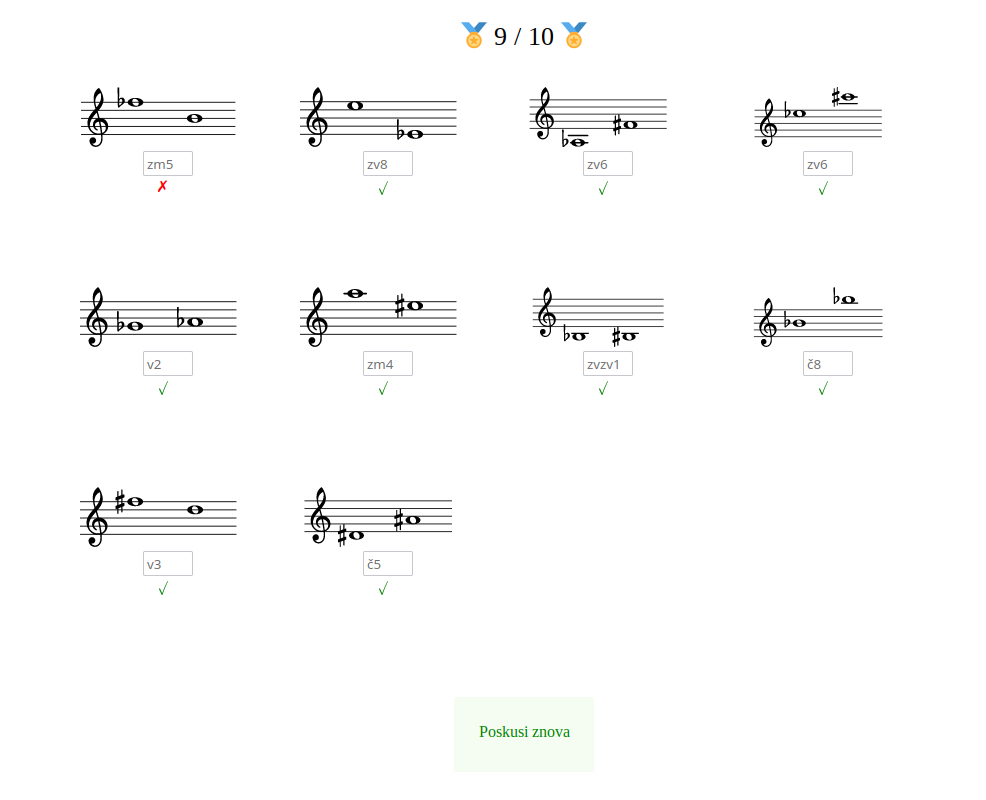

# NoteCheck

A simple django app for [solfege](https://en.wikipedia.org/wiki/Solf%C3%A8ge) exercises.

Currently supported exercises:
- name note pitch (treble or bass clef, optional sharps and/or flats) in English/Slovenian/German language
- name interval between the notes (quantity, quality+quantity, number of fulltones and/or semitones) in English/Slovenian language

## Installation and Quickstart

NoteCheck is a simple django app. It was tested with Django 3.2.6 and Python 3.8
on Ubuntu 20.04.

To setup the app locally:

1. `git clone https://github.com/matevz/notecheck.git; cd notecheck`
2. `export SECRET_KEY=some_secret_key`
3. `./manage.py migrate`
4. `./manage.py createsuperuser` # add at least one admin user
5. `DEBUG=1 ./manage.py runserver`
6. Teacher visits `http://localhost:8000/admin`, logs in and adds an exercise.
   Shares the public exercise link (`http://localhost:8000/<exercise token>`) to
   students, e.g. `http://localhost:8000/6d9b478d-e646-4614-8a95-9b73ece071a0`.
7. Student visits the link and solves the exercise.
8. Teacher can view the submissions in the admin view `http://localhost:8000/admin/notecheck/submission/`.
