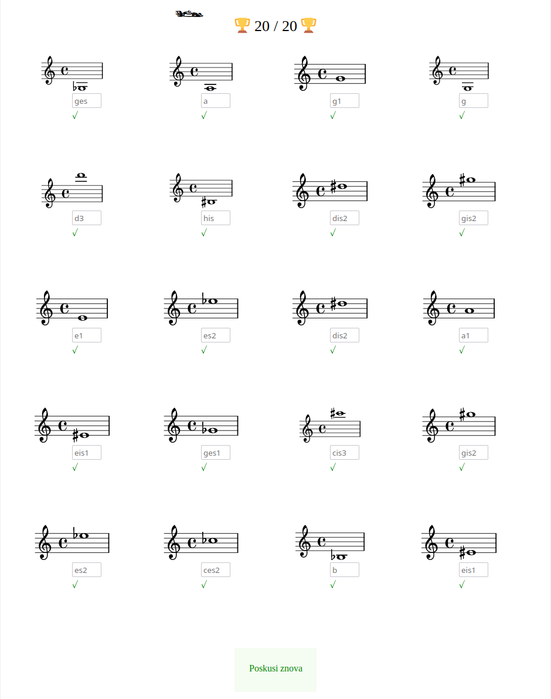

# NoteCheck

A simple django app for [solfege](https://en.wikipedia.org/wiki/Solf%C3%A8ge) exercises.

Currently supported exercises:
- name note pitch (treble or bass clef) in Slovenian language

## Installation

This is a typical django app. Tested with Django 3.2.6 and Python 3.8 on Ubuntu 20.04.

To setup the app locally:

1. `git clone https://github.com/matevz/notecheck.git; cd notecheck`
2. `./manage.py migrate`
3. `./manage.py createsuperuser` # add at least one admin user
4. `SECRET_KEY=your_secret_key DEBUG=1 ./manage.py runserver`
5. Teacher visits `http://localhost:8000/admin`, logs in and adds at an exercise. 
   They remember the newly created exercise token (in UUID format)
6. Student visits `http://localhost:8000/<exercise token>`, e.g. `http://localhost:8000/6d9b478d-e646-4614-8a95-9b73ece071a0`
   and answers the questions.
7. Teacher can view the submissions in the admin view `http://localhost:8000/admin/notecheck/submission/`
